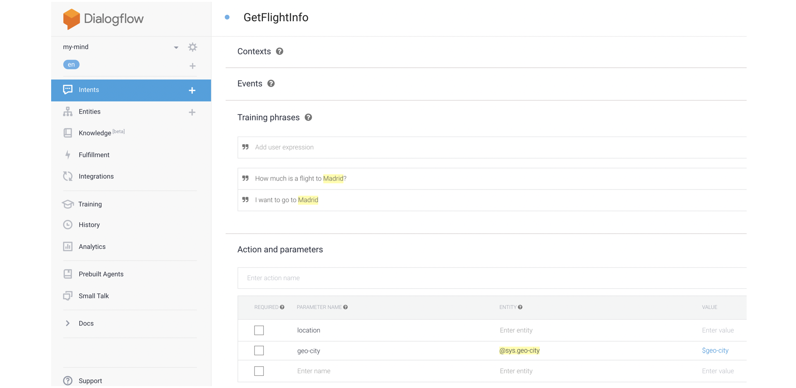

Call Amadeus Low Fares API using Dialogflow
=============================

## Content

- [Overview](#overview)
- [Dialogflow Fulfillment code](#dialogflow-fulfillment-code)

## Overview

This example gets an intent from a user asking for a fare for a parcicular destination, then the agent will reply back with a fare.

First, make sure you understand the basics of Dialogflow: you can start [here](https://dialogflow.com/docs/getting-started).

For this example we just create Agent (`my-mind`) and Intent (`GetFlightInfo`).




https://medium.com/@naz_islam/how-to-authenticate-google-cloud-services-on-heroku-for-node-js-app-dda9f4eda798

Once the app is deployed successfully, we need to set up GOOGLE_APPLICATION_CREDENTIALS environment variable and point it to the path of the service account key. In our case it is ‘config/keyFile.json’.

```
$ heroku config:set GOOGLE_APPLICATION_CREDENTIALS=‘config/<your_key_file>.json’
```


## Dialogflow Fulfillment code

You can find the full code in [index_dialogflow.js](https://github.com/pabloferg/dialogflow1/index_dialogflow.js).

The following code is given by Dialogflow - we will just add the 'const axios =...' to use the package:

```javascript
const axios = require('axios');
```

```javascript
// See https://github.com/dialogflow/dialogflow-fulfillment-nodejs
// for Dialogflow fulfillment library docs, samples, and to report issues
'use strict';
 
const functions = require('firebase-functions');
const {WebhookClient} = require('dialogflow-fulfillment');
const {Card, Suggestion} = require('dialogflow-fulfillment');

const axios = require('axios'); # <====== add

 
process.env.DEBUG = 'dialogflow:debug'; // enables lib debugging statements
 
exports.dialogflowFirebaseFulfillment = functions.https.onRequest((request, response) => {
  const agent = new WebhookClient({ request, response });
  console.log('Dialogflow Request headers: ' + JSON.stringify(request.headers));
  console.log('Dialogflow Request body: ' + JSON.stringify(request.body));
 
  function welcome(agent) {
    agent.add(`Welcome to my agent!`);
  }
 
  function fallback(agent) {
    agent.add(`I didn't understand`);
    agent.add(`I'm sorry, can you try again?`);
  }
```

In order to make our Agent more friendly, we create two functions thant randomly get different sentences to reply.

```javascript  
function GetRandomIntro() {
  const intros = [
    'Sure, let me check', 
    'Checking', 
    'Let me see', 
    'Mmmh give me one sec', 
    'Nice place! Let me check'];
   agent.add(intros[Math.floor(Math.random() * intros.length)]);
}
  
function GetRandomSpeech(destination, fare, airline) {
  const speeches = [
    'You can fly to ' + destination + ' for just ' + fare + ' pounds with ' + airline, 
    'Enjoy ' + destination + ' for just ' + fare + ' pounds with ' + airline, 
    fare + ' pounds with ' + airline, 
    ];
   agent.add(speeches[Math.floor(Math.random() * speeches.length)]);
}  
```

We create the following function.
It will be called when the Intent GetFlightInfo is detected (i.e. user asks *'how much is a flight to Paris?'*)

```javascript  
 function GetFlightInfoHandler(agent) {
   const destination = agent.parameters['geo-city']; 
   
   GetRandomIntro();
   
   return callApi("https://digital-flights.herokuapp.com/destination/" + destination.toLowerCase()).then(response => {
    let fare = response.data.fare;
    let airline = response.data.airline;
     
    GetRandomSpeech(destination, fare.split(".")[0] , airline);
    
  }).catch (error => {
    // do something
  });																								
 }
```

We create this function as well outside the main Intent Handler. It will get the url.

```javascript
function callApi(url) {
  return axios.get(url);
}
```  

In the last part, we just add the `intentMap.set` for our Intent `GetFlightInfo`.

 ``` javascript
  // Run the proper function handler based on the matched Dialogflow intent name
  let intentMap = new Map();
  intentMap.set('Default Welcome Intent', welcome);
  intentMap.set('Default Fallback Intent', fallback);
  intentMap.set('GetFlightInfo', GetFlightInfoHandler);  <============= add
  // intentMap.set('your intent name here', googleAssistantHandler);
  agent.handleRequest(intentMap);
});
```

# Python-Flask Application

First we import the main libraries:

```python
from flask import Flask, jsonify, request
import pandas as pd
import requests
import time
from google.cloud import bigquery
```

The table is stored in BigQuery. Check the [Quickstart Guide](https://cloud.google.com/bigquery/docs/quickstarts/quickstart-client-libraries#client-libraries-install-python) to learn how to access using Python. 

```python
# Initialize a BigQuery Client
client = bigquery.Client()
```

We create a simple Flask application with just:
- (1) a main route ("/") with response "Hello World",
- (2) /destination/ 


```python
# Flask application
application = Flask(__name__)

@application.route("/", methods=['GET', 'POST'])
def index():
    if (request.method == 'POST'):
        some_json = request.get_json()
        return jsonify({'you sent' : some_json}), 201
    else:
        return jsonify({"about" : "Hello World"})   # we are only GETting info from the API so far

# <destination> is the parameter used in Dialogflow to call the url, i.e. digital-flights.herokuapp.com/destination/madrid
@application.route('/destination/<destination>', methods=['GET'])
def get_destination(destination):
    """ 1. Get Airport Code and Airport Name using lookup table in BigQuery
        2. Using Airport Code, call Amadeus API to retrieve fares
    """
    # converts cityName (i.e 'Valencia') to airport Code and Name (i.e 'VLC', 'Valencia Airport')
    airport_code, airport_name = cityName_to_airport(cityName = destination) # If not match, variables = empty

    # this is just a joke
    if destination.lower() not in ['hogwarts', 'mordor']:

        # if destination not in BigQuery Table
        if airport_code == "":
            json_output = jsonify({"error" : "Sorry. We don't fly to %s" % (destination)})
        else:
            # if airport code detected, call Amadeus API
            json = get_request_fares(access_token = post_request_fares(), airport_code=airport_code)
            # try, if except (route from Heathrow does not exist) return full error message in json response
            try:
                # Call Amadeus API
                fare = extract_fare_from_json(json)[0]
                airline = extract_fare_from_json(json)[1]

                json_output = jsonify({"fare" : fare,
                                "airline" : airline,
                                "airportCode" : airport_code,
                                "airportName" : airport_name})
            except:
                json_output = jsonify(json)

    else:
        json_output = jsonify({"fare" : '300',
                        "airline" : 'BroomAir',
                        "airportCode" : airport_code,
                        "airportName" : airport_name})

    return json_output
 ```
 
 ## Call Amadeus Low Fare API
 
The python script will request fares to the Amadeus API for the `destination` picked by the Dialogflow agent. First, we will convert the Name of the destination to its Airport Code equivalent using `cityName_to_airport` function. 

The Amadeus API has a common POST/GET interaction, you can read more about it [here](https://developers.amadeus.com/self-service/category/air/api-doc/flight-low-fare-search/api-reference). First, using a `POST` request we get an `access_token`. Then, with a `GET` request we ask for the json file containing flights and fares. For this example, we hard-coded the GET query with origin in Heathrow Airport (`LHR`), one-way non-stop departure in `2019-07-01` for one adult with British Airways (`BA`).

```json
{"origin":"LHR",
 "destination": "airport_code",
 "departureDate":"2019-07-01",
 "adults":"1",
 "includeAirlines":"BA",
 "nonStop":"false",
 "max":"1"}
```
 
 
 [Amadeus example](#-amadeus-response-example)
 
 You will need `client_id` and `client_secret` from Amadues.
 
 
 
 
 ```python
 #### AMADEUS API ####
def post_request_fares():
    url = "https://test.api.amadeus.com/v1/security/oauth2/token"
    payload = "grant_type=client_credentials&client_id=XXXXX&client_secret=XXXXX&undefined="
    headers = {
        'Content-Type': "application/x-www-form-urlencoded",
        'cache-control': "no-cache",
        'Postman-Token': "52a00ceb-c42c-46bc-a9b7-3afb5f693441"
        }

    response = requests.request("POST", url, data=payload, headers=headers)

    return response.json()['access_token']

def get_request_fares(access_token, airport_code):

    url = "https://test.api.amadeus.com/v1/shopping/flight-offers"

    querystring = {"origin":"LHR",
                   "destination": airport_code,
                   "departureDate":"2019-07-01",
                   "adults":"1",
                   "includeAirlines":"BA",
                   "nonStop":"false",
                   "max":"1"}

    payload = ""
    headers = {
        'Authorization': "Bearer " + access_token,
        'cache-control': "no-cache",
        }

    response = requests.request("GET", url, data=payload, headers=headers, params=querystring)

    return response.json()
 
 
 
```

### extract_fare_from_json
```python
def extract_fare_from_json(json):
    fare = json['data'][0]['offerItems'][0]['pricePerAdult']['total']
    airline = json['data'][0]['offerItems'][0]['services'][0]['segments'][0]['flightSegment']['carrierCode']

    return fare, airline
```


### cityName_to_airport
```python
def cityName_to_airport(cityName):
    """
    Converts name of the city to the airport code using BigQuery lookup table
    cityName : string
    """
    # create query string
    query_string = """
        SELECT * FROM AirportCityCodes.main
        WHERE LOWER(cityName) = '%s'
        """ % cityName.lower()

    # query
    query_job = client.query(query_string)

    results = query_job.result()  # Wait for job to complete.
    df = results.to_dataframe()   # Convert result to dataframe to manipulate it easier (note: check how to do it straightaway)

    if df.shape[0] == 0:         # df is empty   (0 rows)
        airportCode = ""
        airportName = ""
    elif df.shape[0] == 1:                     # unique result (1 rows)
        airportCode = df['airportCode'][0]     # pick the first airport
        airportName = df['airportName'][0]
    else:
        airportCode = df['airportCode'][0]     # If multiple airports, pick the first one (i.e Paris = [CDG, ORY])
        airportName = df['airportName'][0]

    return airportCode, airportName
```

## Amadeus Response example
```json
{
  "data": [
    {
      "type": "flight-offer",
      "id": "1560347341084--1307634387",
      "offerItems": [
        {
          "services": [
            {
              "segments": [
                {
                  "flightSegment": {
                    "departure": {
                      "iataCode": "LHR",
                      "terminal": "5",
                      "at": "2019-07-01T16:45:00+01:00"
                    },
                    "arrival": {
                      "iataCode": "MAD",
                      "terminal": "4S",
                      "at": "2019-07-01T20:10:00+02:00"
                    },
                    "carrierCode": "BA",
                    "number": "464",
                    "aircraft": {
                      "code": "32A"
                    },
                    "operating": {
                      "carrierCode": "BA",
                      "number": "464"
                    },
                    "duration": "0DT2H25M"
                  },
                  "pricingDetailPerAdult": {
                    "travelClass": "ECONOMY",
                    "fareClass": "O",
                    "availability": 5,
                    "fareBasis": "OHZ0SO"
                  }
                }
              ]
            }
          ],
          "price": {
            "total": "119.91",
            "totalTaxes": "37.91"
          },
          "pricePerAdult": {
            "total": "119.91",
            "totalTaxes": "37.91"
          }
        }
      ]
    }
  ],
  "dictionaries": {
    "carriers": {
      "BA": "BRITISH AIRWAYS"
    },
    "currencies": {
      "EUR": "EURO"
    },
    "aircraft": {
      "32A": "AIRBUS INDUSTRIE A320 SHARKLETS"
    },
    "locations": {
      "MAD": {
        "subType": "AIRPORT",
        "detailedName": "ADOLFO SUAREZ BARAJAS"
      },
      "LHR": {
        "subType": "AIRPORT",
        "detailedName": "HEATHROW"
      }
    }
  },
  "meta": {
    "links": {
      "self": "https://test.api.amadeus.com/v1/shopping/flight-offers?origin=LHR&destination=MAD&departureDate=2019-07-01&adults=1&nonStop=true&max=1"
    },
    "currency": "EUR"
  }
}
```
